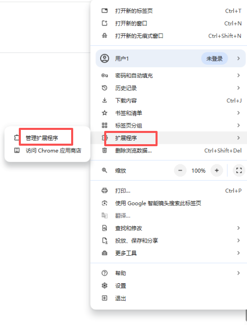
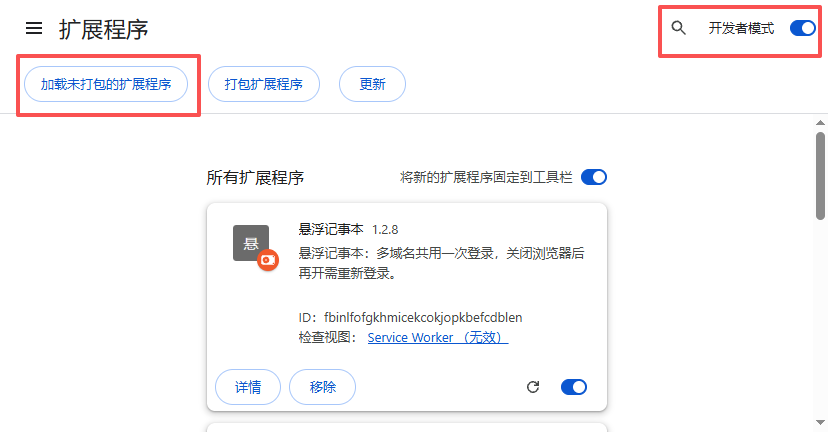

# float-note-extension
> Chrome Extension | Floating Domain Notepad，悬浮记事本Chrome插件

[](LICENSE)
A Manifest V3 Chrome extension of floating notepad. Notes are isolated by website domain, stored locally in browser, with password lock for private memos.

## 📖 Introduction
float-note-extension is a lightweight Chrome extension that provides draggable floating notepad window.
Notes are isolated by website domain and saved locally in your browser. **No data upload to remote server.**
Comes with password lock to protect your private notes.

**中文介绍**
float-note-extension 是基于Manifest V3开发的Chrome浏览器插件。
提供可拖拽悬浮记事窗口，笔记按网站域名隔离，所有内容保存在浏览器本地，不会上传任何服务器，内置密码锁保护私密笔记。
**寻求有缘人，帮忙上架到chrome商店**

## ✨ Features
- 🪟 Floating Window：可拖拽悬浮窗口，置顶在网页上方
- 🌐 Domain Isolation：笔记按域名隔离，不同网站独立保存笔记
- 💾 Local Storage：全部笔记存储在浏览器本地，不上传服务器
- 🔒 Password Protection：密码锁定保护笔记隐私；关闭浏览器后会话失效，需要重新登录
- ⚡ Manifest V3，轻量无第三方依赖

## 📸 Screenshots

> 悬浮记事本主界面，按网站域名分类笔记


> 密码解锁弹窗，保护笔记隐私


> Chrome浏览器菜单，进入管理扩展程序页面


> 开启开发者模式，点击加载未打包的扩展程序

## 🚀 本地加载调试插件
### 方式：Chrome 加载已解压的扩展程序
1. 打开Chrome浏览器，右上角菜单 → 更多工具 → 扩展程序（也可直接访问地址 `chrome://extensions/`）
2. 在扩展程序页面右上角，打开【开发者模式】开关
3. 点击【加载未打包的扩展程序】
4. 在弹窗里选中本项目文件夹 `float-note-extension`（选中文件夹，**不要点进文件夹内部**）
5. 加载完成，悬浮记事本插件即可使用

```bash
git clone https://github.com/zhousijie2017/float-note-extension.git
cd float-note-extension
