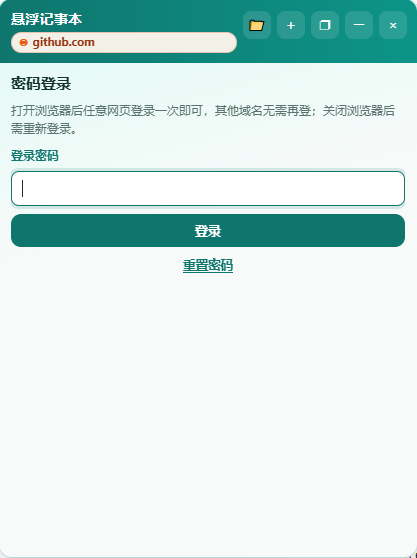
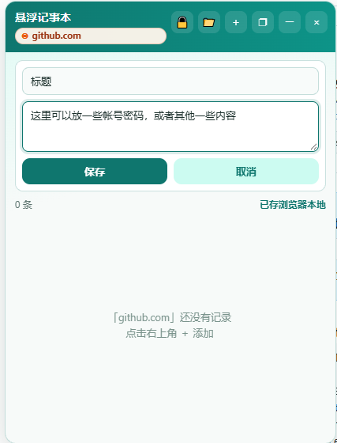

# float-note-extension
> Chrome Extension | Floating Domain Notepad，悬浮记事本Chrome插件

[](LICENSE)
A Manifest V3 Chrome extension, floating notepad with domain-isolated local notes and password lock.

## 📖 Introduction
float-note-extension is a lightweight Chrome extension that provides draggable floating notepad window.
Notes are isolated by website domain and saved locally in your browser. **No data upload to remote server.**
Comes with password lock to protect your private notes.

**中文介绍**
float-note-extension 是基于Manifest V3开发的Chrome浏览器插件。
提供可拖拽悬浮记事窗口，笔记按网站域名隔离，所有内容保存在浏览器本地，不会上传任何服务器，内置密码锁保护私密笔记。
**寻求有缘人，帮忙上架到chrome商店**

## ✨ Features
- 🪟 Floating Window：可拖拽悬浮窗口，置顶在网页上方
- 🌐 Domain Isolation：笔记按域名隔离，不同网站独立保存笔记
- 💾 Local Storage：全部笔记存储在浏览器本地，不上传服务器
- 🔒 Password Protection：密码锁定保护笔记隐私；关闭浏览器后会话失效，需重新登录
- ⚡ Manifest V3，轻量无第三方依赖

## 📸 Screenshots

> 主界面：当前域名笔记列表


> 密码登录解锁界面

> 使用方法：将你的两张截图放到仓库根目录，命名为 screenshot1.png、screenshot2.png

## 🚀 本地加载调试插件
```bash
git clone https://github.com/zhousijie2017/float-note-extension.git
cd float-note-extension
